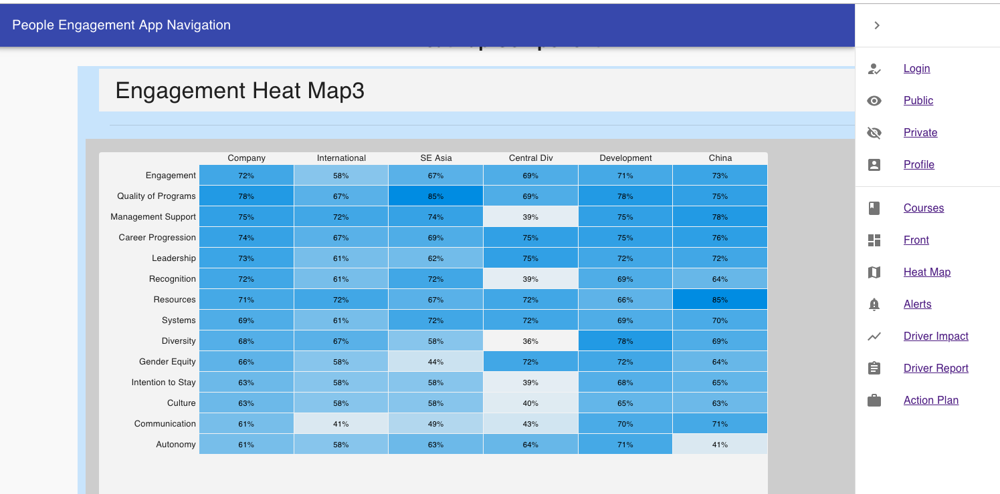

## Wireframe

One feature of the App is a Heatmap that will allow decision-makers to see how different departments in the organization compare on all important 'drivers' or factors that affect employee engagement (i.e., resources, management support, autonomy), as well as engagement itself.

A heatmap is a superior alternative to something like a correlation matrix or bland descriptive statistics table. The colors provide visual cues for senior executives to understand where each departments are along important dimensions, which allows them an "at-a-glance" view to see relative strengths and weakness across all departments.

Here is the wireframe:


## React-Heatmap-Grid

My initial exploration into heatmaps was through the react-heatmap-grid [npm package](https://www.npmjs.com/package/react-heatmap-grid).

This allowed me to get a sense for how the author of the package approached heatmaps. Here's an imported heatmap:



In exploring this library, the most important thing was understanding the data structure for all the cells (array of arrays).

The external heatmap library has their data structure set up in a generic way, so the challenge was manipulating the component to fit my data.

I wanted organization department on the x-axis and engagement factors on the y-axis, so the following structure worked best:

```
const data = [
  [72, 58, 67, 69, 71, 73],
  [78, 67, 85, 69, 78, 75],
  [75, 72, 74, 39, 75, 78],
  [74, 67, 69, 75, 75, 76],
  [73, 61, 62, 75, 72, 72],
  [72, 61, 72, 39, 69, 64],
  [71, 72, 67, 72, 66, 85],
  [69, 61, 72, 72, 69, 70],
  [68, 67, 58, 36, 78, 69],
  [66, 58, 44, 72, 72, 64],
  [63, 58, 58, 39, 68, 65],
  [63, 58, 58, 40, 65, 63],
  [61, 41, 49, 43, 70, 71],
  [61, 58, 63, 64, 71, 41]
];
```

Nevertheless, there is only so much control you have when using an external package.

## Custom Heatmap from Material-UI components

My next challenge then, was to build a custom heatmap out of Material-UI components.

I ended up using a mixture of Grid and Box components from material-ui/core.

I first created Grid containers as columns to house the department data. The reason is, when doing an engagement survey, each department (i.e., HR, Accounting, Finance, Marketing, Operations) is likely to have all their data grouped together by department.

Then each department would be it's own component that I would import into each Grid container. The driver 'names' on the y-axis would also need to be it's own component.

This is version one:


I wanted to have control over the rectangles containing numerical data and I wanted the heatmap to have two colors, instead of one, with different shading.

This involved using the .map function to filter through an array of numbers, rendering material-ui boxes with _conditional_ styling depending on the number:

```
const numbers = [72, 78, 75, 74, 73, 72, 71, 69, 68, 66, 63, 63, 62, 61];
const max = 78;
const min = 61;
```

It took a while to figure out how to manipulate the different color shades; for Blue, darker colors would represent 'higher' numbers, but for Red, the darker colors would represent 'lower' numbers.

```
style={{
    backgroundColor:
    number > 66
    ? `rgb(0, 151, 230, ${1 -
        (max - number) / (max - min)}   )`
    : `rgb(255, 0 , 0 , ${(max - number) / (max - min)}  )`
}}
```

Finally, I got the colors to line up according to how I wanted to visualize department data:


