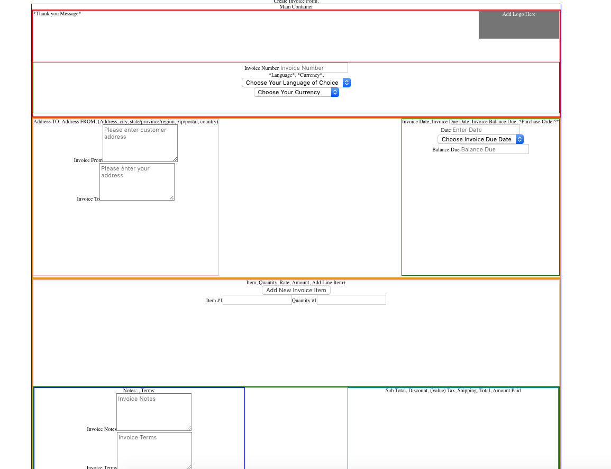

## Part 1 - Individual Accomplishments this Sprint
This past week, my primary task was to create a display page for our app, namely the Invoice List page and Create Invoice page. I was able to get a basic html structure up, section-tags and div-tags and I was able to do very basic CSS styling to put boundaries around the various sections of the page. 

I also got the functionality for the Create Invoice page to work. First, I got it so that all form input was stored on local state. Then, I re-did the whole thing to where ALL user data was stored in one data object, ready to be sent to the backend. 

In this regard, the challenge was creating sub, reusable, components sending props to the main form component so that form local "state" would store all invoice related data in one data object so it can be sent to the backend. 

Handling different data types and input fields was a challenge as it required importing many child components, passing props to child components, but having user data stored on the parent component. 

## Detailed Analysis

The Create Invoice page is where a user will enter all relevant data needed to create and generate an invoice. This includes all data ranging from Invoice Due Date to the Item Description to total Amount Due from the customer. Therefore, this page represents a gathering of various types of data the user will need to send to _her_ customer

Once the user clicks generate, all the data should be saved and sent to the backend for storage, retrieval, editing and deletion (CRUD) at a later time. 

We wanted to have a main create-invoice-form component (parent) that would store all user input data on local state, before sending to the backend.

Because the form is complex, there are several child components (reusable components) that send props to the create-invoice-form component. 

Getting all incoming data from various child components into one data object was one of the challenges. Particularly in handling different data types.

The is an added layer of complexity when you get to the "items" section of the invoice. Here, we want our users to be able to add multiple items - dynamically - into the invoice form. Then, after multiple items, when the user clicks "generate", the data object would capture all relevant info and _all_ items where the amount due would be summed all at once. 

A screenshot is provided below.

## Part 2 - Milestone Reflections

Writing the TDD was a great learning experience. I tried to contribute to all sections of the TDD. I analyzed competing Invoice Apps to figure out what the basic and advanced features were. Looking at competing apps also helped me get clear about the various "user stories" that we wanted to have. Thinking through the user stories really helped make the idea of an Invoice App clearer in my mind. 

Writing out the User Stories and Features of the App helped cement the App better in my mind in terms of what our App would need to look like and be able to do. 

Oh, and here's a great quote from this Wikipedia on
[salted duck eggs](http://en.wikipedia.org/wiki/Salted_duck_egg).

> A salted duck egg is a Chinese preserved food product made by soaking duck
> eggs in brine, or packing each egg in damp, salted charcoal. In Asian
> supermarkets, these eggs are sometimes sold covered in a thick layer of salted
> charcoal paste. The eggs may also be sold with the salted paste removed,
> wrapped in plastic, and vacuum packed. From the salt curing process, the
> salted duck eggs have a briny aroma, a gelatin-like egg white and a
> firm-textured, round yolk that is bright orange-red in color.

