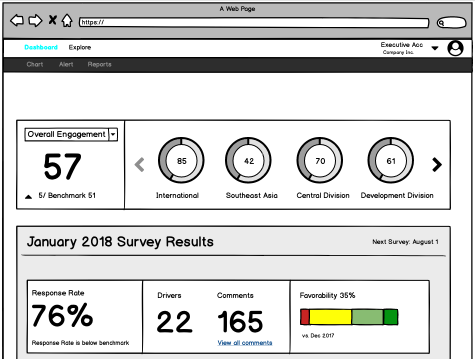
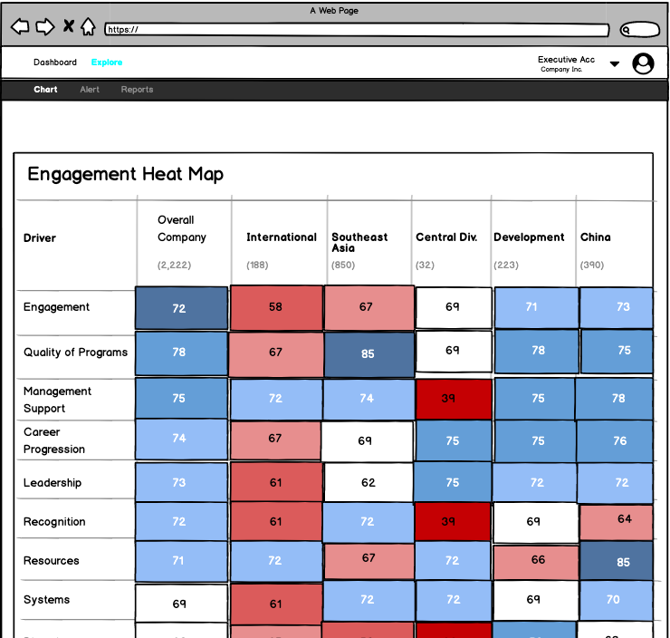
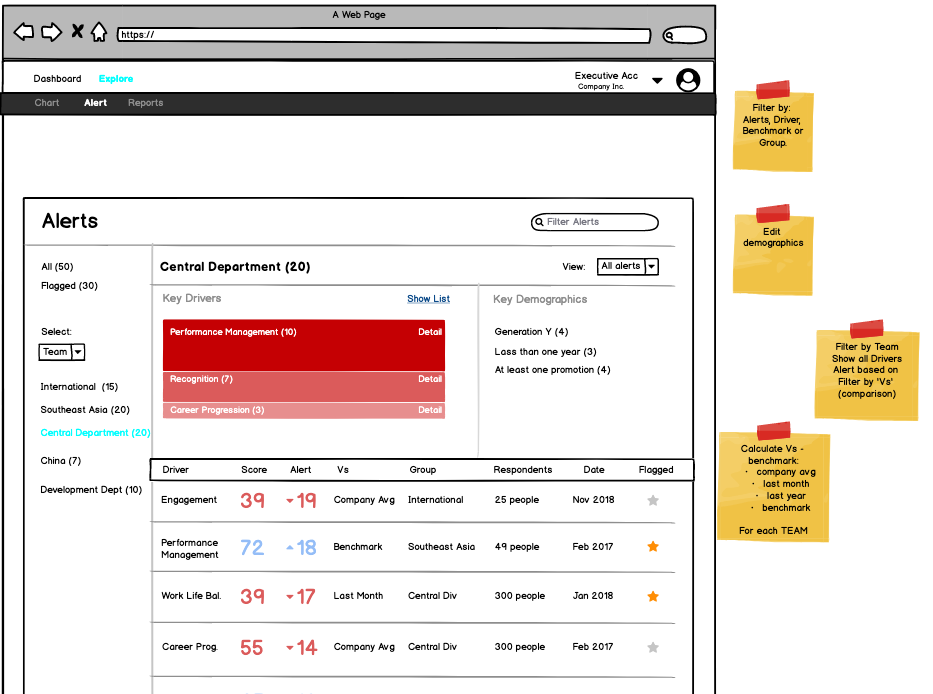

## Technical Designs

### Architectural Choices

**Front End**

- React (React Context)
- Apollo Client

I definitely wanted to go deeper in using React; the front-end libraries I plan to use including Material-UI, Chart.js, D3.js all integrate with React.

I'll be using React Context to pass Authentication-related component data to various components. Initially, I'll also be implementing Authorization via Role-Based Access Control. I don't anticipate needing Redux, but its an option if I change my mind.

I plan to use GraphQL to handle all survey data once I transfer it to the backend and Apollo Client will allow me to send queries to the backend.

**Back End**

- Node/Express (Authentication/Authorization)
- GraphQL Yoga (Survey Data)

I think NodeJS/Express will allow use the industry standard security solutions (Auth0 and OAuth); it'll help secure different API endpoints for accessing certain pages. But I imagine i'll have to assign roles and different levels of access on GraphQL queries as well.

**Deployment**

- Netlify (Frontend)
- AWS (Backend)

For quick deployment, i'll use Netlify. The initial phase of the project will be mainly focused on the front-end. Once data gets migrated to the backend, i'll use a AWS solution.

**Design**

- Material UI
- ChartJS
- D3JS
- DevExtreme React Grid

Since the goal is to visualize data in a way as to make it more accessible, understandable and amenable to data-driven decisions, I'll be using many charting solutions.

**External APIs**

For the most part, i'll be writing internal API endpoints to query data. The one external API I could use is Google Sheet API - which would better streamline the flow from data collection, to analysis, to visualization.

### Wireframes

Here are some example wireframes I've developed to guide this project:

**Front Dashboard**

**Heat Map**

**Executive View**

