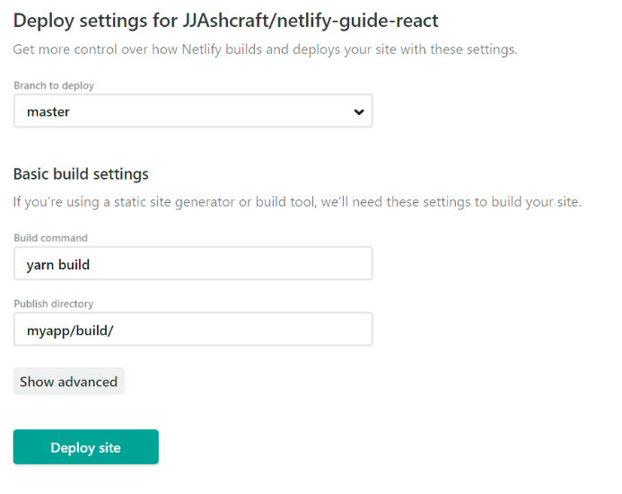

## Deploying on Netlify

Here are the steps I took to deploy a React App with Auth0 authentication on Netlify.

### Step 0

Create-react-app and basic Netlify setup [source](https://hackernoon.com/netlify-continuous-deployment-github-react-lambdaschool-67f3ae658d31)

### Step 1

Create netlify.toml file outside of the App directory with the following content:

```
[build]
base = "my-people/"
publish = "my-people/build/"
command = "yarn build"
```

### Step 1a

Make sure Basic Build Settings in Netlify
Settings > Build & Deploy > Build Settings

For continous deployment from the github repo

**My Build Settings**


**Alternative Build Settings**



### Step 2

Make sure Auth0 is configured correctly.

_NOTE_: Create a new "tenant" in Auth0 for Production (vs Development) environments

- Create an account with Auth0; create new tenant for Production environment, separate from Development environment
- Create a new application in the tenant.
- Assuming the app is a SPA (single page application)
- In the Settings for your new Auth0 application, add your URL to Allowed Callback URL, in my case (https://focused-kirch-10cac8.netlify.com/)
- Replace the clientID in the SPA with the client id from your Auth0 dashboard.
- Replace redirectUri in the SPA with the Allowed callback URL from your Auth0 dashboard.
- Ensure the Allowed Web Origins, Allowed Origins(CORS) in your Auth0 dashboard is set to your live URL. In my case, https://focused-kirch-10cac8.netlify.com/.
- Your audience should be the audience you set when you created the API for the backend.

All this amounts to your .env file being created to match the new tenant and application in Auth0:

**sample env file**


Also setup your environment variables in Netlify settings


### Step 3

Create `_redirects` file for Single Page Application
I got conflicting information on this one:

- Netlify documentation says you can add \_redirect file to root of the application or to `netlify.toml` file [source](https://www.netlify.com/docs/redirects/)
- React documentation says you can add `_redirect` to the public directory [source](https://facebook.github.io/create-react-app/docs/deployment)

I ended up adding `_redirect` file to build/\_redirect and public/\_redirect

All sources were in agreement on the contents of the `_redirect` file:

```
/*    /index.html   200
```

### Step 4

Make sure you have your API set-up in Auth0 with the correct identifier

REACT_APP_AUTH0_AUDIENCE in both `.env` and Environment settings in Netlify point to http://localhost:3001 and that should be the identifier setup in your Auth0 API
