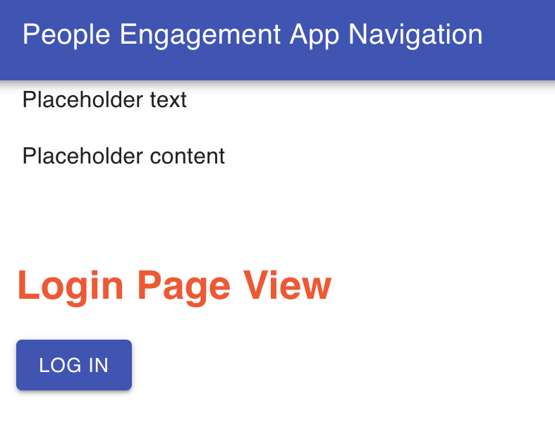
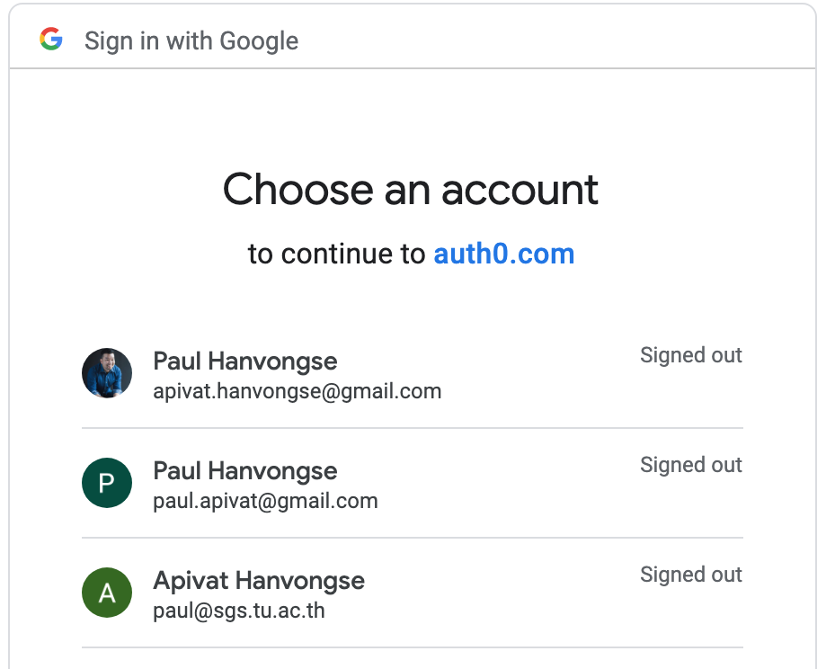

## Why

Last year, I conducted an engagement survey for a consulting client. This involved survey construction, survey administration, data collection, data analysis and interpretation so the executive team could make personnel decisions.

Making sense of the data was a challenge.

People in organizations vary in their comfort with statistical data. While I enjoy discussing the fundamentals of correlation and regression, I realized we needed _better tools_ to visualize the data.

Coming off Labs, I want to do an _independent_ Labs so I can build a survey data visualization tool. This will help me refine skills and build a portfolio piece that's connected to the work i'm doing.

## Progress So Far

#### Authentication

The first thing I worked on was setting up Authentiation via . I'm using **implicit flow** and **universal login** for the App. Users will be directed to Auth0 for sign-in; they'll receive an identity token upon sign-in; then they'll be re-directed back to a callback URL that I've setup. Universal login is hosted by Auth0, with security benefits from having a single centralized login.

Basic login for the App


Auth0 Universal login


To make sure Authentication is working, I distinguish Public vs Private APIs; with the latter, login is required to access. To demonstrate, I created two server endpoints - a public & private endpoint.

```
app.get("/public", function(req, res) {
  res.json({
    message: "Hello from a public API!"
  });
});

app.get("/private", checkJwt, function(req, res) {
  res.json({
    message: "Hello from a private API!"
  });
});

```

You'll notice with a "private" endpoint, there's a function - checkJwt that checks for the user's access and id token:

```
const checkJwt = jwt({
  // Dynamically provide a signing key based on the kid in the header
  // and the signing keys provided by the JWKS endpoint.
  secret: jwksRsa.expressJwtSecret({
    cache: true, // cache the signing key
    rateLimit: true,
    jwksRequestsPerMinute: 5, // prevent attackers from requesting more than 5 per minute
    jwksUri: `https://${
      process.env.REACT_APP_AUTH0_DOMAIN
    }/.well-known/jwks.json`
  }),

  // Validate the audience and the issuer.
  audience: process.env.REACT_APP_AUTH0_AUDIENCE,
  issuer: `https://${process.env.REACT_APP_AUTH0_DOMAIN}/`,

  // This must match the algorithm selected in the Auth0 dashboard under your app's advanced settings under the OAuth tab
  algorithms: ["RS256"]
});
```

#### Authorization
