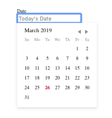
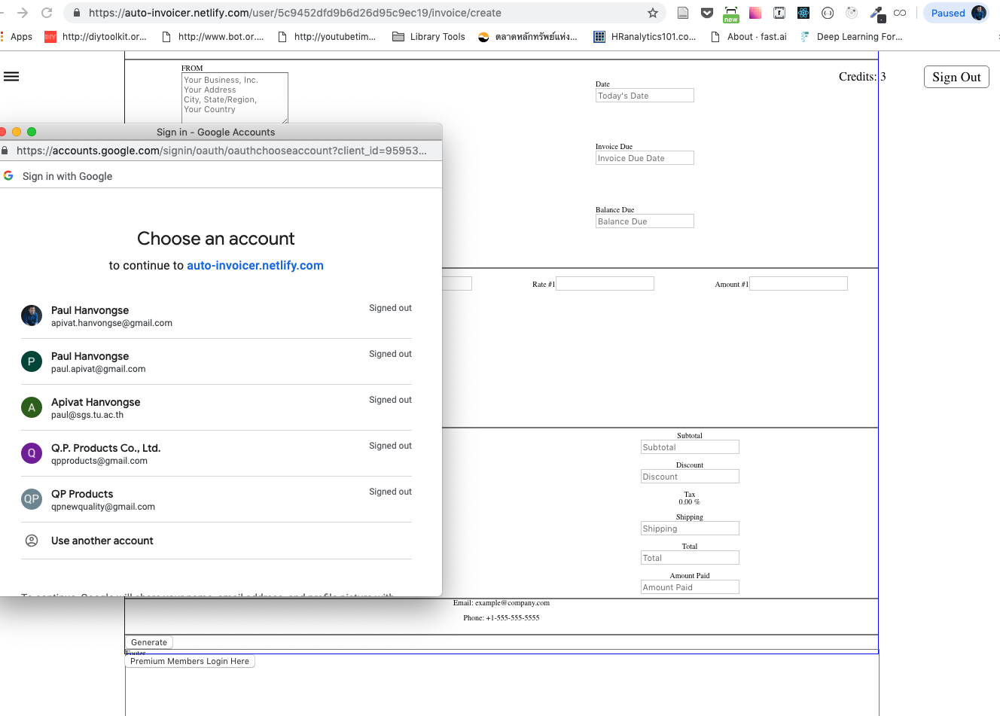
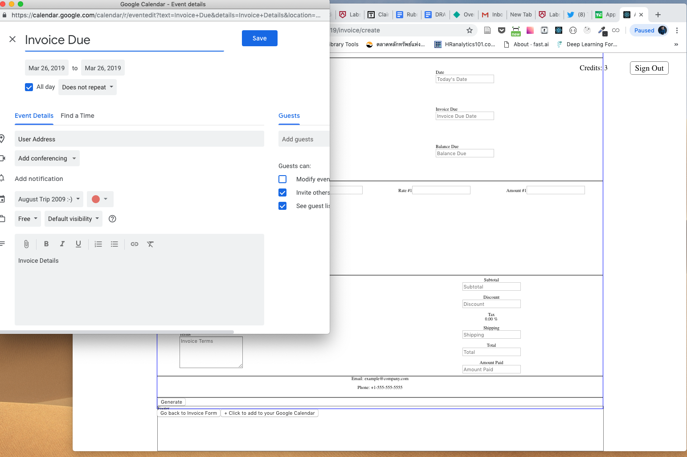

Labs Sprint 2 Challenge. 

## Part 1 - Individual Accomplishment this Sprint

This past sprint, I worked primarily on getting our calendar feature ready and functional. When creating a new invoice, our Invoice App will allow our users to pick a current and due date for the invoice. The challenge for me was getting a React calendar component that would allow users to pick a date - and, this was the challenging part - having the dates picked be added to ONE data object when the user clicks "generate" in creating a new invoice. Finally, I was able to hook up a react-day-picker component to our application, allowing users to send up the data object as one object. 

The second challenge was communication-originated. When we were discussing our wireframe, it was very basic and only after starting to REALLY think about features and user experience did I realize we needed TWO separate calendar functions. One day picker and one for Google Calendar API - where we wanted the user to be able to add an "invoice due" event to their own personal (google) calendar. 

Figuring out how to use Google Calendar API within the context of how we wanted users to experience the application was a huge challenge. Google Calendar API is not the easiest to understand. I spent several days trying to read the documents and figuring things out. 

Most of my work this past sprint was in React. I had to translate Vanilla Javascript to React was another challenge. I ended up using the react-day-picker component and mixing and matching an implementation of accessing Google Calendar API on the frontend. 

 

Accomplishment:
- Successfully Implementing a Calendar using [React Day Picker](https://react-day-picker.js.org/)
- Successfully Implementing [Google Calendar API](https://developers.google.com/calendar/)

At the end of the day, we need to have two calendar functions, not one. That was a revelation for me. 

### Detailed Analysis

My most challenging ticket was implementing Google Calendar API.

I had to implement a user sign-in first, then that would lead to a button that, when clicked opened up the user's Google Calendar, with a ready made template ready for the user to enter event details into their calendar. 

The first button prompts users to log into their Google Account. 

Then once logged in, the second button opens a new popup window directly into a Calendar Event template. 

When the user fills out that calendar event, it gets added to their calendar, they can close out that popup window and get back to their create invoice form.

This involved first creating a GoogleCalApi component. This component would essentially have 'isSignedIn' on state to indicate whether the user was logged in or not. 

This component would have componentDidMount() lifecycle method to interact with my own GOOGLE API CLIENT_ID, Discovery Docs and Scopes. There are functions to handle logging in and out. Finally, there is a function to update the state once user is logged in or out. 

The GoogleCalApi component would wrap around another component called AddToCalendar which is the button that users click, once logged in to their google account, to open up a Calendar Event Template. 

For AddToCalendar, I found someone else's frontend implementation of opening Google Calendar in pure Vanilla Javascript. My task was to translate this into a React component. After many days, I finally got a working solution. 

### Part 2 - Weekly Reflection

One of the biggest challenges in operating in a team is not wanting to let your teammates down. As I struggled with getting the calendar function(s) to be right, I was mindful of not wanting to let my team down. 

What I tried to do was communicate my challenges with the group. To keep the lines of communication open and to let the group know it's healthy to communicate challenges one is facing (*psychological safety*). I also reached out to certain members to try to get unblocked. 

I try celebrating teammates accomplishment outside of Labs (when one member got a job); I setup individual check-ins with members to discuss what we're each working on. I reach out to my team to have them teach me stuff.

This upcoming week, I'll be working heavily with the backend team to try to get more integration between the front and backend. 

