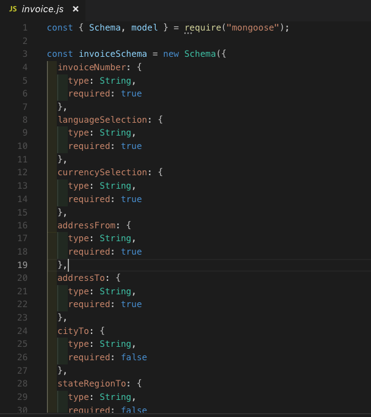
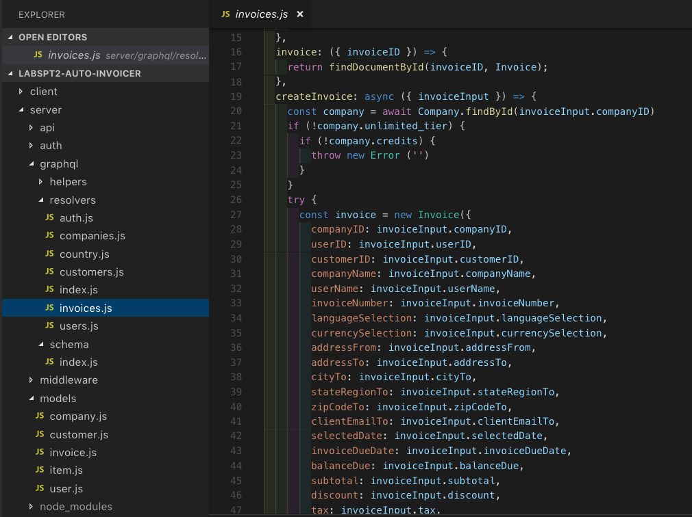
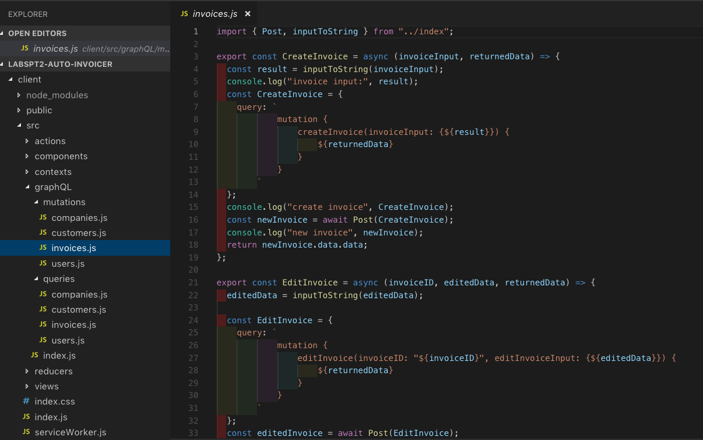
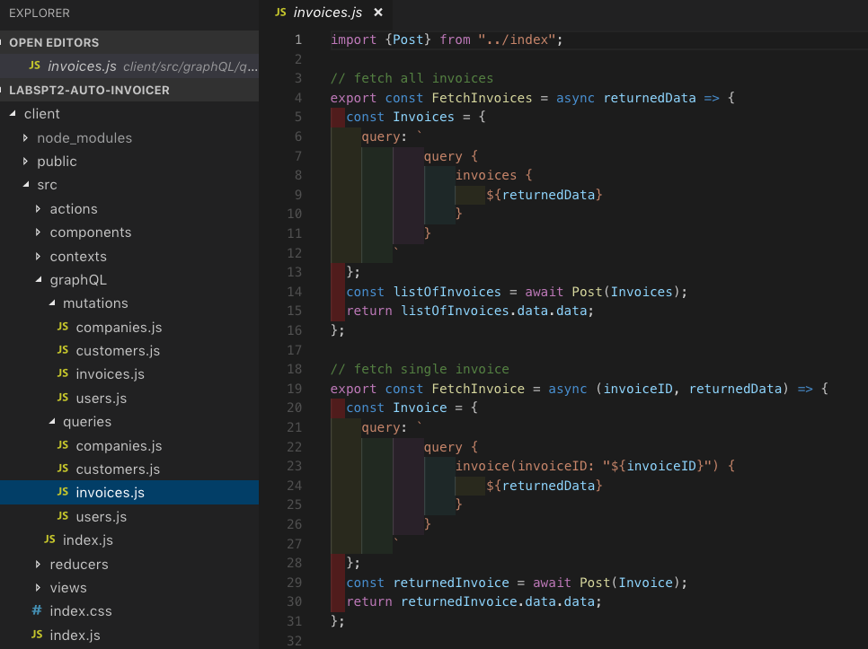

## Part 1 - Individual Accomplishment this Sprint

For Sprint 3, our task was to get to feature complete for our MVP. This week the frontend and backend got integrated. My work started with helping to create a basic model and schema for the invoice form, which would allow us to create mutation (when the user generates a new invoice) and query (to display generated invoices on the invoice list) and further mutation (to edit invoices). 

Then, I created the Edit Invoice (and Invoice View, but we decided that wasn't needed) component and _routes_ to connect Create Invoice form to the Invoice List and Edit Invoice view. This include all necessary redirects from the Invoice Form to the Invoice List to the Edit view. 

I also made the CreateInvoice component responsive, but held off on making the Edit Invoice responsive because we will significantly be refractoring and styling the component. 

This week's challenge was about coordinating with the backend team to enable mvp features that needed to render/display on the frontend. 

 

Accomplishments:
- Create model, schema for Invoice on the backend 

- Create Edit Invoice component 
- Create routes to connect Create Invoice to Invoice List
- Make Create Invoice Responsive

### Detailed Analysis

My most challenging task was making sure we could send Invoice data to the database, then query it from the database to be displayed back on the frontend. 

First, I had to create the Invoice schema, resolvers, on the backend to allow the Invoice form to be connected to the database. I had to get familiar with GraphQL as well as the specific style the backend team had setup other schemas and resolvers (ie., user, company).

An intermediate step is testing queries and mutations on GraphiQL before connecting it to the frontend via handlers that contained specific queries and mutation.

This requires setting up GraphQL mutations and queries, specifically for the Invoice form. 

Moreover, because our MVP - feature complete - meant that when the User created the Invoice, it downloads a PDF before redirecting back to the Invoice List to display a new Invoice Card as either paid, unpaid or late, there was some routes that had to be created to connect the Invoice List. 

Finally, after each Invoice Card is generated, the user needs to be able to Edit the Invoice to update its content so that the card can change color from "unpaid" to "paid". This required creating a separate Edit Invoice component - along with EditInvoice mutations. 

Fortunately, I had a lot of help from my team mates. 

Finally, I had to make the Invoice Form "responsive" - this was trickier than I had anticipated because it required getting re-acquainted with styled-components, but also figuring out styled-components in the context of Material-UI. 

### Part 2 - Weekly Reflection

This Sprint #3 was very different from the two previous sprints. Previously, I felt a bit isolated as I worked on the frontend components with little to no integration with the backend. 

This week, that all changed. 

Getting to feature complete meant we had to collaborate much more intensely. There were many moving parts just from the Invoice form and I haven't even begun to scratch the surface of other parts like Billing, Settings and the glue that ties everything together React Context to allow Users who sign-in to have a unique user ID.

On top of that, we lost a key member of our team (who got a job!). 

I found myself reaching out to the backend team more and trying to understand their codebase. Fortunately, I think losing a member of team brought us all closer as a unit. We all rallied. 

The biggest part of the work, in my opinion, wasn't necessarily the code per se, but stuff outside of coding - 
- checking in with teammates, 
- reaching out for help, 
- being available to jump on zoom/pair program at odd hours, 
- being responsive on slack.

