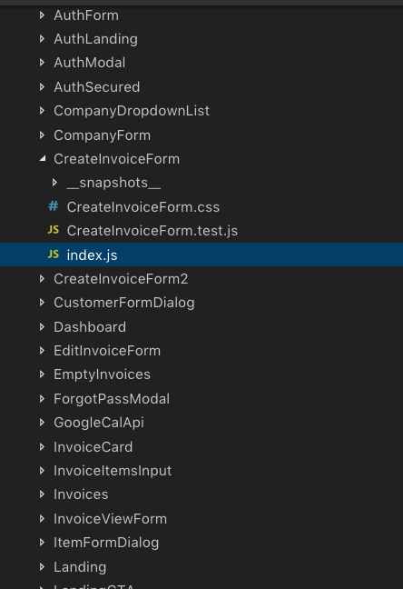

## Part 1 - Individual Accomplishment this Sprint

For this sprint, I refactored the code for our App's invoice form. In getting to functional MVP, I had to ignore style and code organization; it ultimately got unwieldy and became much too long (600+ lines of code). 

At the beginning, our lead guy had suggested we structure our code as Component Directory, index.js, Component.css, Component.testjs. This seemed like a good way to organize the code base and, for most of the project, it's a nice structure. 

However, the invoice form has many sub-components so this meant creating different directories for each component in the invoice form (ie invoice number, date picker, each input field for the address, item description, rate, quantity, amount, and finally, _all_ the input fields adding to a total balance due - shipping, taxes, discounts, all of that).

Long story short, major refactoring was needed.

On top of that, the original invoice form used basic html elements - "form", "input" and many divs. This sprint, being about UX and design, required a complete overhaul of the invoice form. 

To do this, I used Material-UI. I personally found this to be more complicated than it sounds. 

Accomplishments:
- Changed the invoice form styling with Material-UI
- Refactored the Invoice component code structure

### Detailed Analysis

I basically had to re-create a new invoice form that would be professional looking for the user _and_ better organized for our team so when it came time to hooking it up with the backend, people wouldn't have to go digging for components in different folders - all components related to the invoice needed to be housed within that component folder. 

Here's the old folder structure

Here's the new folder structure

Directory organization may seem trivial, but it translates to the index file of the new invoice form having 40% less code.

### Material-UI

The big learning for me was Material-UI. I had to 
- familiarize myself with the documentation
- understand the component system for Material-UI
- understand the grid system for organizing components in Material-UI
- understand how styes are handled, in HOC, injecting styles

Then, after getting a lay of the land, it was about 
- creating a grid structure that would be responsive
- importing indiviual components
- creating change handlers for entry into the various TextFields
- then making design-decision; using a combination of styles component, injecting withStyles and also in-line styles (this was required to make it responsive within the material-ui setup)

But, I also had to keep in mind that the previous functionality that we got working last week (APIs, sending data to GraphQL, creating queries and migration), had to work under the _newly_ structured invoice form with material-ui logic. 
- in some cases, it was transporting over API calls from the previous version
- other times, it was discarding an external library in favor of _native_ Material-UI components (i.e., date picker); in retrospect, I had spent three days working on a calendar component that could have very easily been accomplished with Material-UI

Top Invoice (normal view):

Bottom Invoice (normal view):

Top Invoice (responsive):

Bottom Invoice (responsive):

### Part 2 - Weekly Reflection

This Sprint #4 continued our collaboration within the team. Because the focus this week was on UX, our backend team jumped into the frontend to take on styling tasks. 

We had wanted to go beyond the bare essentials in the MVP and initial wireframe, so this required creating a new Dashboard and styling for the Settings page.

Moreover, we wanted some _advanced_ features for the invoice form (pop-up modal for each invoice item, the ability to have Customers/Companies dropdown for the user to pick, before the App executes autofill).

All of this meant our backend team jumped to the front to pick up styling tasks, which was pretty impressive to see. All members of the team are truly "full stack". If anything, I definitely need more practice on the backend. 

The challenge is maintaining functionality as we basically overhauled last week's design. Moreover, establishing frontend-backend connections for new features (Dashboard and Invoice Items).

This requires coordination and communication, which we've all definitey stepped up since the last sprint. 