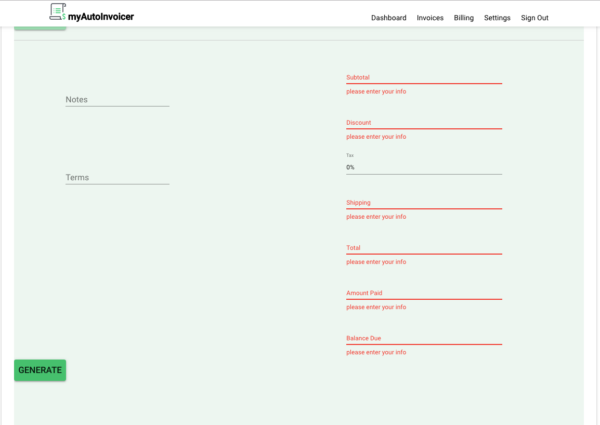

## Part 1 - Individual Accomplishment this Sprint

For this sprint, I did a number of tasks including:

1. Create the first draft of our project's documentation. [source](https://github.com/Lambda-School-Labs/labspt2-auto-invoicer/blob/master/README2.md)

2. Implement _form validation_ to ensure that users fill out all necessary input fields on the Invoice before submitting the data to the backend.



3. Create an Edit Popup Modal so users can click on any row on the Invoice List and make updates to Total, Amount Paid and Balance Due.


4. Transition Invoice Form content to a new "Steppers" layout. The team felt this presentational flow would be more user-friendly.


5. Create an Invoice Summary form to accompany the new steppers-layout for creating an invoice. This summary form will auto-populate as a user progresses through the five stages creating an invoice.


### Detailed Analysis

#### Hooks & Steppers

The team was really excited about using Hooks, particularly in the context of "React Context". Using Hooks basically enables you to change all class components into functional component, while still accessing state. The primary benefits include:

- more easily re-use/share stateful logic between components
- reduced syntax
- limit side effects to a particular component

I still need more experience with Hooks because just as I was about to refactor the existing invoice form to use Hooks, the team decided they wanted to change the invoice form to enable Material-UI Steppers - this meant structurally changing the Invoice component _AND_ at the same time, employing Hooks.

What this has amounted to is:

1. Instead of the invoice form being _one_ giant component, there is one component (CreateInvoiceStepper) with many sub-component: Customer form, Dates, Invoice Items, Other details
2. This results in better user-experience. Instead of the user being confronted with one large form to fill out, the process is broken up into five _steps_ so filling out an invoice form is not as tedious.
3. While previously, I had restructurd the directory of the invoice form to be more composable. The new structure really reinforces the idea of separate components - not just at the directory level, but also at the code level. For example, InvoiceCustomer, Date Selector, SingleLineInput are all separate components that are imported into the CreateInvoiceStepper.
4. An explicit focus on separate components is further reinforced with Hooks where each component is a _functional_ component, instead of a class-based one. We now employe useState() and useEffect(), for life-cycle methods.

#### Form Validation

For the previous invoice form, I create form validation because we found that users may have a tendency to forget to fill out an important input field. Fortunately, this is fairly straight forward with Material-UI.

1. I passed `error` and `helperText` as props with each individual component (i.e., InvoiceNumberInput).
2. Add `errorText` to the Invoice form local state.
3. In handleFormSubmit, write a conditional to check if the length of component is `0` (if it is, then the user forgot to write something), in that case, setState of `errorText` to notify the user.
4. Back on the invoice, write ternary to check if a component is entered, if not, the `errorText` also flashes.

```
error={
this.state.invoiceNumber.length === 0
    ? !!this.state.errorText
    : false
}
helperText={
this.state.invoiceNumber
    ? !!this.state.errorText
    : this.state.errorText
}
```

### Part 2 - Weekly Reflection

As we entered the final sprint, we realized that in order for our App to be fully polished and, more importantly, something we could show _prospective employers_, we needed more time. As a group we agreed that it was more important for us to come out of Labs with a project we're really proud of, so we agreed to extend by one more sprint.

Its invigorating to be on a team where everyone really cares about the final product, so it was an easy choice to make in pushing off CS by two weeks.

We all want the App to be _really_ nice and something we're proud of. The flip side of this is we, at times, dance on the line between "going the extra mile" and "scope creep". We have a lot of new features we want to implement including: a dashboard, a customer page, a 404 page, implementing Hooks for Global state, changing the invoice form layout. All of these features are intended to improve user experience. And yet, it's not always clear what is scope creep - often time these features came up as we got more experience developing the Application.

Nevertheless, we all try to do what's best for the team.

We have functionality and design from prior sprints, but the challenge is integrating that into the new layout that we want to implement.
