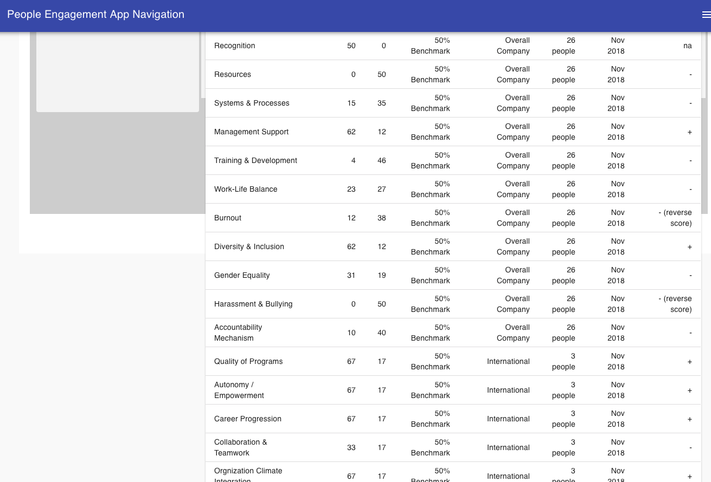
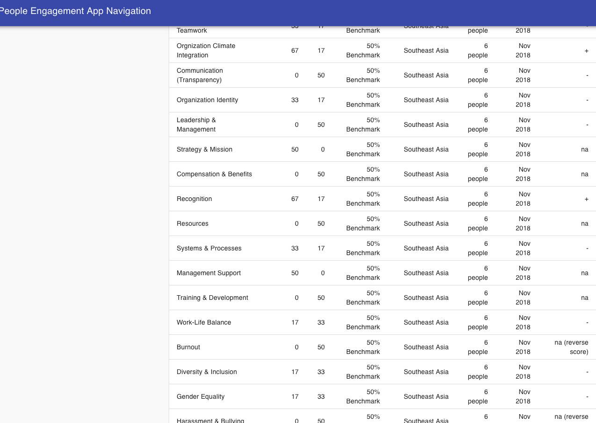
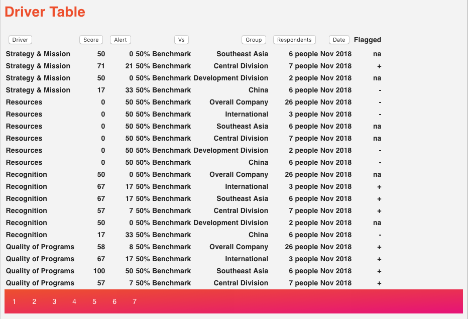

## Alert Page Driver Table

The purpose of the Alert Page is to provide an 'executive view' where high level decision-makers can view all driver scores across different departments. 

Similar to the data presented in the Heat Map, the Alert page provides cross division comparison in driver scores as well as additional data including: benchmark comparisons, alert - plus/minus compared to benchmark, and number of respondents per division -- the extra data of which is not accounted for in the Heat Map (which is more visual in nature).

The data format for the Alert Page is therefore a table.

## Why Pagination?

The problem is, there are 21 drivers, across 6 divisions, giving the table 126 rows. 

Here's the table *without* pagination:





You can see the table spilling out of the container. 

I've already implemented [table sorting](https://www.gitpush.net/tablesort/) by numbers and alphabet which allows users to see driver scores and alert numbers in ascending and descending order. Moreover, through alphabet sorting, we can cluster data by driver or by division.

Nevertheless, sorting doesn't help if users have to scroll down 126 rows. Hence, we need pagination.

## Pagination

Material-UI gives users the ability to [customize pagination](https://material-ui.com/components/tables/#custom-table-pagination-action) for its tables, however, copying and pasting in this situation is not ideal for learning. 

There are a lot of moving parts to pagination that I wanted to be able to integrate into my specific project, so I decided to find a way to build it from the ground up.


## Loading the Data

I ended up following this [tutorial](https://www.youtube.com/watch?v=IYCa1F-OWmk&t=607s), "Simple Frontend Pagination | React". 

The first step is the load the data. This particular resource uses Hooks (useState, useEffects) to load dummy data from an external json file. 

```
const App = () => {
  const [posts, setPosts] = useState([]);
  const [loading, setLoading] = useState(false);
  const [currentPage, setCurrentPage] = useState(1);
  const [postsPerPage, setPostsPerPage] = useState(10);

  useEffect(() => {
    const fetchPosts = async () => {
      setLoading(true);
      const res = await axios.get('https://jsonplaceholder.typicode.com/posts'); // same as my data.json files
      setPosts(res.data);
      setLoading(false);
    }

    fetchPosts();
  }, []);
```

Because my data, for now, is stored on the frontend, I have a json file that I would import instead of loading it from an external site like jsonplaceholder.typicode.com 

```
useEffect(() => {
        const fetchPosts = async () => {
            setLoading(true);
            const res = await data;
            setPosts(res); 
            setLoading(false);
            console.log('same as previous res.data', res)
        }

        fetchPosts();
    }, []);
```

The next step is to define currentPosts

```
const currentPosts = posts.slice(indexOfFirstPost, indexOfLastPost);
```

The current posts is sent to Posts component through props:

```
return (
        <div className="container mt-5">
            <h1 className="text-primary mb-3">Driver Table</h1>
            <Posts posts={currentPosts} loading={loading} />
            <Pagination postsPerPage={postsPerPage} totalPosts={data.length} paginate={paginate} />
        </div>
    );
```

## Posts component

This component is essentially the structure of the table, with props of *only* the current posts sent down. 

So instead of all 126 rows, the postsPerPage, which defines the currentPosts, is set to 20 rows per page:

```
const [loading, setLoading] = useState(false);
const [currentPage, setCurrentPage] = useState(1);
const [postsPerPage, setPostsPerPage] = useState(20);
```

postsPerPage sets up the parameter for currentPosts

```
const indexOfLastPost = currentPage * postsPerPage;
const indexOfFirstPost = indexOfLastPost - postsPerPage;
const currentPosts = posts.slice(indexOfFirstPost, indexOfLastPost);
```

## Pagination

Pagination is added allowing users to skip however many pages they want to see later rows in the table. It is placed right below the Posts table:

```
<h1 className="text-primary mb-3">Driver Table</h1>
<Posts posts={currentPosts} loading={loading} />
<Pagination postsPerPage={postsPerPage} totalPosts={data.length} paginate={paginate} />
```

It is a matter of defining the pageNumbers via postsPerPage and totalPosts. 

```
const Pagination = ({ postsPerPage, totalPosts, paginate }) => {
    const pageNumbers = [];

    for (let i = 1; i <= Math.ceil(totalPosts / postsPerPage); i++) {
        pageNumbers.push(i);
    }

    return (
        <nav>
            <ul className="pagination">
                {pageNumbers.map(number => (
                    <li key={number} className="page-item">
                        <a onClick={() => paginate(number)} className="page-link">
                            {number}
                        </a>
                    </li>
                ))}
            </ul>
        </nav>
    )
}
```

## Challenge

The challenge was integrating this custom pagination with the existing table with Sort.

Therefore, I figured that I needed to add the sort functions I had previous defined into the Posts component where the table is defined. This way users can still click each Column Heading to sort the data via driver, score, alert, benchmark, division, respondents, data or flagged. 

The end product is a table that can do both sorting and pagination:



However, that table is quite buggy. Clicking on each column head works, but the user needs to paginate to the next page before the results are shown on screen. 

I'll address the bug in a future post. 