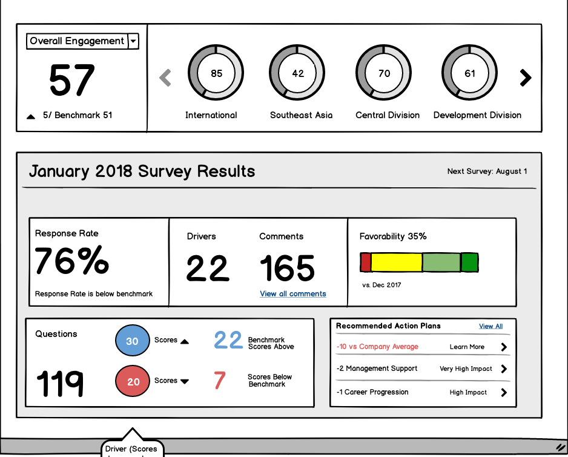

## Front Page Wireframe

The purpose of this component is to provide users with a quick-glance view of Employee Engagement across the organization and departments: overall engagement, southeast asian, central division so on and so forth.

There's also broad survey-level data including response rates, number of engagement drivers examined, questions, favorability index, as well as scores above and below benchmark.

This quick view allows executive level decision-makers to see where progress has been made, areas where a department took a step back.

Here's the wireframe:

## Appreciating the React Way

This past week I finally completed the frontend MVP for this component. While I was already familiar with the _React Way_, I had a better appreciation from organizing the code for thie particular component. Every feature, whether as simple as displaying a % figure, a drop down box, a blue circle, a list or something with more moving parts like a donut-chart, everything was it's own component.

The idea was to prevent the main component from getting too cluttered.
