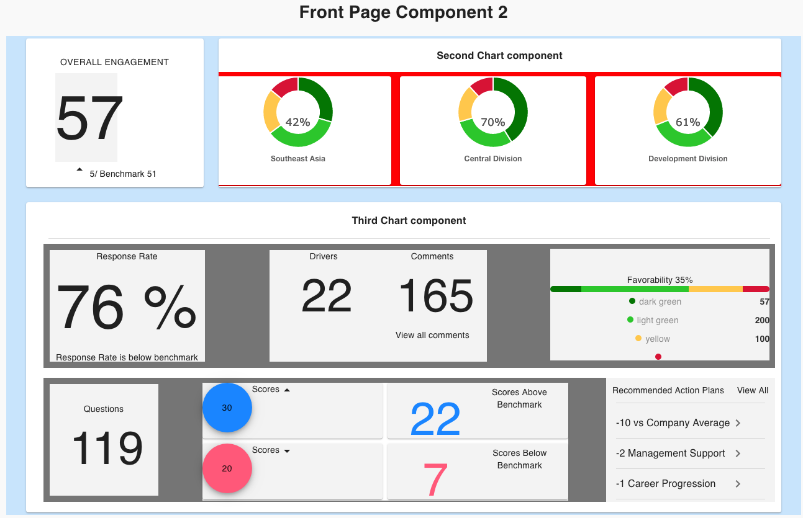

## Front Page Wireframe

The purpose of this component is to provide users with a quick-glance view of Employee Engagement across the organization and departments: overall engagement, southeast asian, central division so on and so forth.

There's also broad survey-level data including response rates, number of engagement drivers examined, questions, favorability index, as well as scores above and below benchmark.

This quick view allows executive level decision-makers to see where progress has been made, areas where a department took a step back.

Here's the wireframe:

## Appreciating the React Way

While I was already somewhat familiar with [_thinking in React_](https://reactjs.org/docs/thinking-in-react.html), I got an even better appreciation from organizing the code for thie particular component.

Every feature, whether as simple as displaying a % figure, a drop down box, a blue circle, a list or something with more moving parts like a donut-chart, everything was it's own component.

The idea was to prevent the main component from getting too cluttered.

## Permission to be Ugly

This past week I finally completed the frontend MVP for this component. What helps is knowing that the MVP is supposed to be ugly.

For the moment I'm using dummy data, the next step will be to clean up the layout, then import _real_ data, then comes the harder part of thinking about storing data on state.

Finally, the idea is to implement Hooks to keep state data located in one place. More soon.
