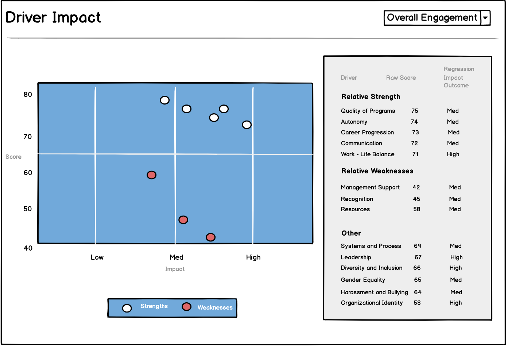
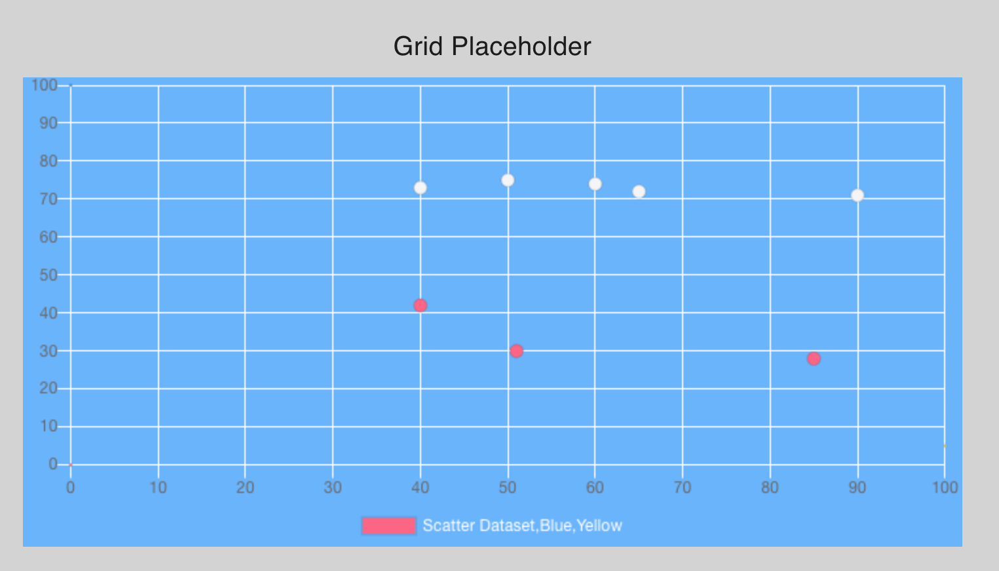
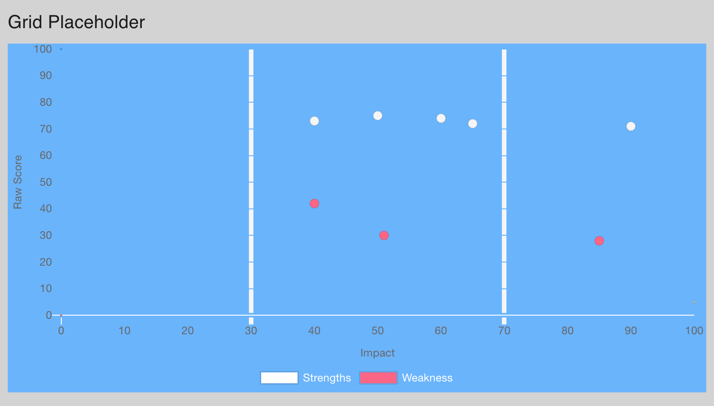

## Wireframe

The purpose of a Scatter Chart is to allow users to visualize the relative strengths and weakness of their department based on various engagement driver (i.e., Quality of Programs, Autonomy, Career Progression etc).

The idea was to visualize two separate datasets for areas of strengths **and** weakness. This would be captured on the Y-Axis in terms of a department's raw score on any of the engagement driver.

Moreover, I wanted to show the relative impact of each engagement driver. This allows decision-makers to see where they score _and_ how much impact each driver make.

Not all high- or low- scoring driver is equally impactful; decisions should be driven by impact as well as raw scores.

Here's the wireframe:

## ChartJS

On the front page, I had gone back and forth between using different libraries for a Donut Chart.

I initially went with [react-svg-donut-chart](https://www.npmjs.com/package/react-svg-donut-chart), but later opted for [ChartJS](https://www.chartjs.org/) because it had decent documentation, allowing me to customize it in a way the was suitable for the project.

## Scatter Chart

Ultimately, getting this chart right came down to reading documentation to customize both the dataset and chart areas of the Scatter Chart.

This included breaking the dataset into two (strength vs weakness), with two indicators in the legend, different colors for each, as well as labels for the X-Axes and Y-Axes.

I also wanted a specific dodger blue for the chart background, which I ended up manipulating as the background color for the Box elment that would contain the Scatter chart component.

Before:

After:

The trickiest customization was ensuring that the gridlines on the X-Axes only highlighted _impact levels_ at 30 and 70.
