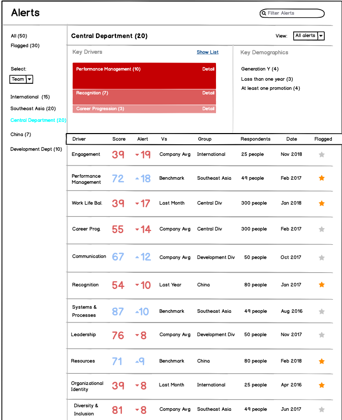
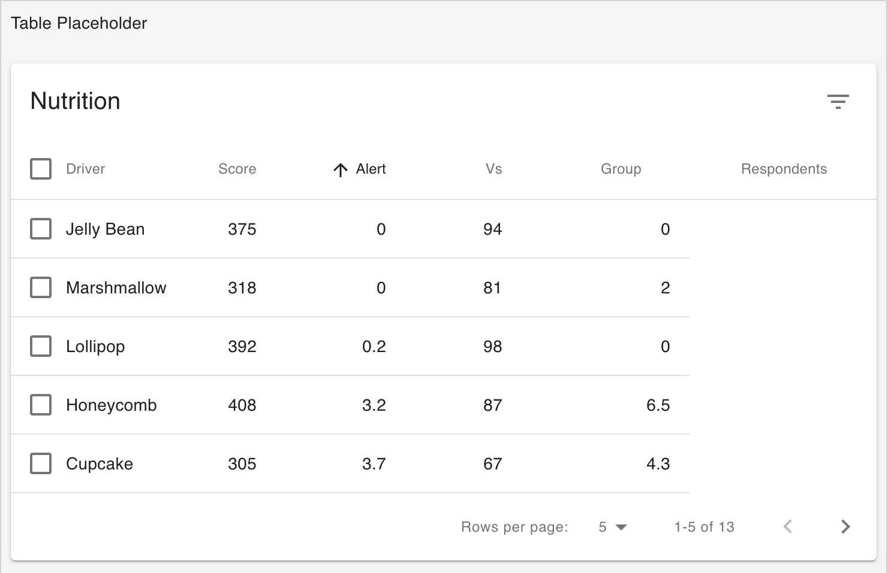
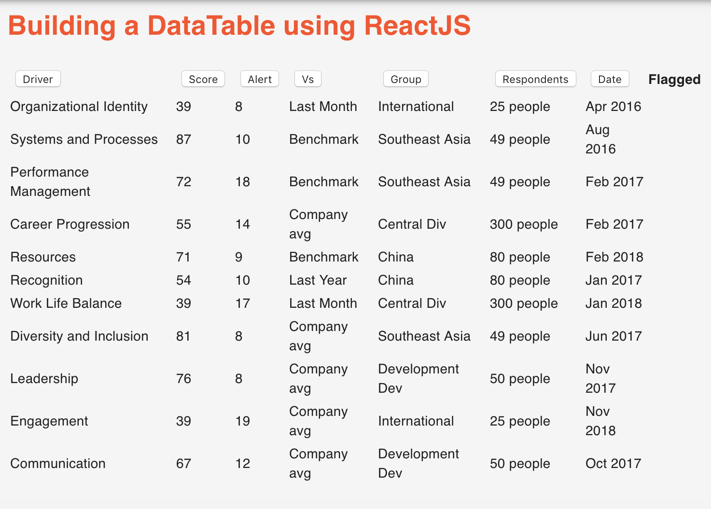

## Wireframe

The purpose of this particular Table within the Alert page is to allow users to visualize, at a glance, how the entire organization is functioning with respect to various engagement drivers.

The intended user(s) are executive decision makers who will want all engagement related data in _one_ table. In other words, this table provides an "Executive Summary" of the data.

It shows _each_ driver's score for _each_ department with associated comparison data (i.e., company average, benchmark, last month, last year etc), the raw score and alerts for when there is notable discrepancy between the current scores and benchmark.



## Desired Goal

When this component is fully completed, the user should be able to both sort _and_ filter by individual columns. As a decision-maker, I could pull up data specific to any one department, one engagement variable, or sort by scores to see which department scored highest on what engagement variable.

However, for the MVP, i'm focused on only sorting on each column as the dataset will be limited. Filtering (and search) functionality will be especially useful with larger datasets.

## Library vs DIY

My initial thought was to use Material-UI's [table component](https://material-ui.com/components/tables/), particularly their ready-made sorting & selecting functionality built-in.



The trade-off, in my view, is less control and understandability. Importing the component wholesale would appear to save time upfront, but I quickly ran into issues when I wanted to add columns, and extend sorting functionality to the new columns.

While I could navigate my away around the _simple_ table component, once sorting and selecting was added, the code complexity increased to the point where I felt it was better to build a table from the ground up.



## Building a Table with Sorting from scratch

Fortunately, I found a [tutorial](https://www.youtube.com/watch?v=akxsFgM7DPA) to help guide the broad strokes for how this is done. Nevertheless, substantial customization was needed to build the table for my specific use case.

### Step 1: Create dataset in JSON

An array of objects in JSON will be imported and passed down as props to the actual table component. For example, one object in the JSON file would have all data required for one table row.

```
 {
    "id": "organizational identity",
    "driver": "Organizational Identity",
    "score": "39",
    "alert": "8",
    "vs": "Last Month",
    "group": "International",
    "respondents": "25 people",
    "date": "Apr 2016",
    "flagged": false
  },
```

### Step 2: Create table component

I opted to create a barebones table from JSX elements, with the intention of using Material-UI's table component structure once I was comfortable enough building in the sort functionality.

The basic structure is like so:

```
<table>
    <thead>
        <tr></tr>
        <tr></tr>
    </thead>
    <tbody>
    </tbody>
</table>
```

### Step 3: Create separate component for Sort functionality

This component stores data on state. Additionally, sort function(s) are created that will _update_ the data via setState based on javascript's **sort()** function.

The sortBy function takes in a "key" parameter which, in this case, represents any of the key properties in the data object (i.e., driver, score, alert, group, respondents etc).

The sort() function alone will sort the data _once_, so an additional "toggle" functionality is needed to allow the data to be re-sorted (ascending to descending and back to ascending) upon each click.

This is achieved by adding 'direction' in state as 'asc', then changing state from 'asc' to 'desc' with each click, and finally setting conditional sorting, changing direction of sort ('asc' or 'desc') depending on what is currently set.

Here's the code for sorting numerically. ParseFloat is used to transform strings, the format in JSON, into numbers.

```
sortBy(key) {
    this.setState({
      data: data.sort((a, b) =>
        this.state.direction[key] === "asc" //sorting in both directions
          ? parseFloat(a[key]) - parseFloat(b[key])
          : parseFloat(b[key]) - parseFloat(a[key])
      ),
      direction: {
        //toggle
        [key]: this.state.direction[key] === "asc" ? "desc" : "asc"
      }
    });
    console.log("key: ", key);
  }
```

On the other hand some table columns are non-numerical and require sorting alphabetically. Several people on stackoverflow recommended localeCompare as best practice:

```
sortByAlpha(key) {
    this.setState({
      data: data.sort((a, b) =>
        this.state.direction[key] === "asc"
          ? a[key].localeCompare(b[key])
          : b[key].localeCompare(a[key])
      ),
      direction: {
        //toggle
        [key]: this.state.direction[key] === "asc" ? "desc" : "asc"
      }
    });
    console.log("key: ", key);
  }
```

Finally, both sort functions and the data is passed down to AlertDataTable.js component via props.
